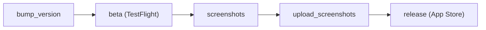

# Pizza-Man

Get in on the App Store: <https://apps.apple.com/us/app/pizza-man/id931174800>

The iOS game

Devour this devilishly difficult diversion.

This game takes place in the future where man has left the planet and only pizza remains!

Help this 7-slice plain pizza pie indulge in incoming pepperoni pieces.

You will become immortal (in real life) if you reach level 100.

* Email <englishmajor@phor.net> if you're able to add additional alliteration above

---

## Development

### Requirements

* Xcode 15.0+

* iOS 15.0+
* Swift 5.9+

### Building

This project uses modern iOS development practices and can be built using Xcode or the command line:

```sh
xcodebuild -project "Pizza Man.xcodeproj" -scheme "Pizza Man" -configuration Debug -destination "platform=iOS Simulator,name=iPhone 15,OS=latest" build
```

### Continuous integration

The project includes GitHub Actions CI that automatically builds and tests the app on every push and pull request.

### Releasing a new version

The release process uses [fastlane](https://fastlane.tools).

### One-time setup

1. Install Ruby via rbenv (macOS system Ruby is too old for fastlane):

   ```sh
   brew install rbenv ruby-build
   rbenv init # follow the printed shell setup instructions, then restart your shell
   rbenv install   # installs the version from .ruby-version
   bundle install
   ```

2. Create `fastlane/api_key.json`:

   ```json
   {
     "key_id": "ABCD123456",
     "issuer_id": "00000000-0000-0000-0000-000000000000",
     "key_filepath": "/absolute/path/to/AuthKey_ABCD123456.p8"
   }
   ```

The pipeline has five stages.



Execute the end-to-end flow with the combined command:

```sh
bundle exec fastlane full_release notes:"Update game center"
```

Or run individual stages:

1. Bump the marketing version (`CFBundleShortVersionString`) and build number:

   ```sh
   bundle exec fastlane bump_version           # patch (default): 4.0.1 → 4.0.2
   bundle exec fastlane bump_version bump:minor
   bundle exec fastlane bump_version bump:major
   ```

   Then update `app_version` in [fastlane/Deliverfile](fastlane/Deliverfile) to match the new version. Commit the version bump.

2. Build, sign, and ship to TestFlight. This bumps the build number, archives, exports, and uploads:

   ```sh
   bundle exec fastlane beta
   ```

   Test the build on a real device via TestFlight.

3. Capture screenshots when needed. The lane supports quick testing of one locale or device:

   ```sh
   bundle exec fastlane screenshots
   bundle exec fastlane screenshots locales:en-US devices:"iPhone 16 Pro"
   ```

4. Upload screenshots separately from submission:

   ```sh
   bundle exec fastlane upload_screenshots
   ```

5. Submit to the App Store. The `release` lane is submit-only:

   ```sh
   bundle exec fastlane release notes:"Update game center"
   ```

:information_source: If a beta upload fails because the build number is behind App Store Connect, set the project build number once to remote highest + 1, commit, rerun, then continue local increments.

:information_source: The `before_all` hook in [fastlane/Fastfile](fastlane/Fastfile) strips `/opt/homebrew` and `/usr/local` from `PATH` before `xcodebuild -exportArchive` runs. Without this, Xcode 26's IPA packaging step fails with `Copy failed` because `/usr/bin/rsync` (openrsync 2.6.9) and Homebrew's `rsync` 3.x interpret the `-E` flag differently. Sanitizing `PATH` ensures both ends use openrsync.

---

The app is named because the hero (at center) is a pizza. The things that he is eating are pepperoni.


